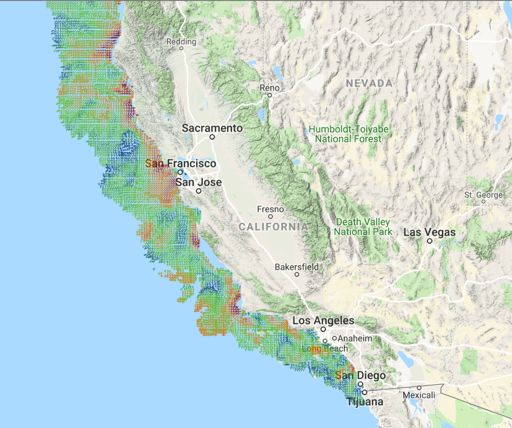
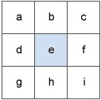

# Overview  

While change is constant in the marine environment, the effect of wind, waves, landmasses and the rotation of the earth (among other things) lead to dynamic patterns of fluid movement in the form of currents. Areas where currents form features that interact with one another, such as the fronts between currents moving at differing speeds or opposing directions, are of particular interest because of their potential to aggregate biomass. Patterns in currents are ephemeral, but recent developments in remote sensing technology have allowed us to observe these patterns at ever increasing spatial and temporal resolution. A growing body of literature has delved into the linkages between animal habitat selection and environmental features such as fronts and eddies. Much of the research to date has focused on satellite remote sensing of meso-scale features (10-100Km) with a temporal resolution of 1 to 8 days. Here we aim to develop a methodology for analyzing fine-scale (hourly, 2-6Km) surface current features using the High Frequency Radar collected by the Coastal Observing Research and Development Center.



This markdown processes Surface Current data downloaded from <http://www.sccoos.org/data/hfrnet/>. The NetCDF file has a time series array of U and V values, which denote Surface current movements in the Easterly and Northerly directions respectively. From these raw surface current data we will calculate a measure of two-dimensional particle movement called Vorticity. 

Vorticity is a measurement of the rate of rotation in a fluid. Rotation in the ocean is influenced primarily by the rotation of the Earth itself, but countless other dynamic factors (e.g. bathymetry, wind, currents) act to produce areas of varying vorticity in the ocean. While we are measuring rotation in the hoizontal plane using HF Radar, vorticity also has a vertical component that has the potential to influence circulation through the water column below. 


```{r setup, echo=FALSE, message=FALSE, warning=FALSE, collapse=TRUE}
pkgTest <- function(x)
{
  if (!require(x,character.only = TRUE))
  {
    install.packages(x,dep=TRUE)
    if(!require(x,character.only = TRUE)) stop("Package not found")
  }
}
pkgTest("ncdf4")
pkgTest("chron")
pkgTest("lattice")
pkgTest("RColorBrewer")
pkgTest("oce")
pkgTest("raster")
pkgTest("tidyverse")
pkgTest("ggpubr")
pkgTest("lubridate")
pkgTest("rnaturalearth")

```

# Data Processing

Workflow:

1. Upload NetCDF
2. Extract Data: Time, U and V arrays
3. Calculate Vorticity
4. Plot Vorticity 

## Import Surface Current Raw Data

Surface Current data downloaded from [Southern California Coastal Ocean Observing System](http://www.sccoos.org/data/hfrnet/).

> The Southern California Coastal Ocean Observing System (SCCOOS) is one of eleven regions that contributes to the national U.S. Integrated Ocean Observing System (IOOS). The regional observing systems work to collect, integrate, and deliver coastal and ocean observations in order to improve safety, enhance the economy, and protect the environment.
>
> From <http://sccoos.org/overview/>

The Download URL for this Example  
<http://hfrnet-tds.ucsd.edu/thredds/ncss/HFR/USWC/2km/hourly/RTV/HFRADAR_US_West_Coast_2km_Resolution_Hourly_RTV_best.ncd?var=u&var=v&north=34.5&west=-120.75&east=-119.25&south=33.75&disableProjSubset=on&horizStride=1&time_start=2017-06-15T00%3A00%3A00Z&time_end=2017-07-15T00%3A00%3A00Z&timeStride=1&addLatLon=true&accept=netcdf>

**Data Overview:**
```{r Import, echo=TRUE, message=FALSE, warning=FALSE}
ncname <- "./vorticity_RMDfiles/RTV_HFRADAR_US_West_Coast_2km_Resolution_Hourly_RTV_best.nc"#file.choose()
dnameU <- "u"
dnameV <- "v"
# Import NetCDF file
ncin <- nc_open(ncname)
# NETCDF Global Attributes
cat(paste0(unlist(ncatt_get(ncin, 0, "title"))[2],"\n\n",
           unlist(ncatt_get(ncin, 0, "institution"))[2],
           "\n\nSummary:\n",
           unlist(ncatt_get(ncin, 0, "summary"))[2],
           "\n\nReferences:\n",
           unlist(ncatt_get(ncin, 0, "references"))[2]))
```

## Extract and Process Variables

The netCDF file contains an array of raster grids, one for each time period. In this example, periods are in 1 hour increments from 6/15/2017 00:00 UTC to 7/15/2017 12:00 UTC, resulting in 721 samples. Each sample in this example spans a grid that is 42 x 73 cells, covering an area in the Santa Barbara Channel in Southern CA.

Here we extract the data for processing and plot the U and V grids to get a sense of the data. We can conveniently extract the NetCDF data into a raster stack object, which preserves the original projection information. Rasters are also easily converted into dataframes for plotting and manipulation.

```{r Process, echo=TRUE, fig.height=10, fig.width=8, message=FALSE, warning=FALSE}
# Boundaries of raster
ncLatMin <- unlist(ncatt_get(ncin, 0, "geospatial_lat_min"))[2]
ncLatMax <- unlist(ncatt_get(ncin, 0, "geospatial_lat_max"))[2]
ncLonMin <- unlist(ncatt_get(ncin, 0, "geospatial_lon_min"))[2]
ncLonMax <- unlist(ncatt_get(ncin, 0, "geospatial_lon_max"))[2]
# Extract Lat and Long
lon <- ncvar_get(ncin, "lon")
nlon <- dim(lon) # number of columns in data
lat <- ncvar_get(ncin, "lat", verbose = F)
nlat <- dim(lat) # number of rows
#Extract Time
t <- ncvar_get(ncin, "time")
tunits <- ncatt_get(ncin, "time", "units")
nt <- dim(t) # number of time steps in dataset
# Convert Origin of data into mm dd yyyy
tustr <- strsplit(tunits$value, " ")
tdstr <- strsplit(unlist(tustr)[3], "-")
tmonth = as.integer(unlist(tdstr)[2])
tday = as.integer(unlist(tdstr)[3])
tyear = as.integer(unlist(tdstr)[1])
# t is in hours since 10/1/2011, need to divide by 24to convert to days
t_True <- chron(t/24, origin = c(tmonth, tday, tyear), format= c(dates= "m/d/y", times="h:m:s"))
# convert to PosixC with Timexone of GMT
timeP <- as.POSIXct(paste(as.Date(dates(t_True)),times(t_True)%%1), tz = "GMT")
attr(timeP, "tzone") <- "GMT" # Set TZ to GMT

# Create a Raster Stack with U and V Vectors
# Extract U - surface_eastward_sea_water_velocity
u_stack <- stack(ncname, varname = "u") # Extract as a Raster Stack 
# Extract V - surface_northward_sea_water_velocity
v_stack <- stack(ncname, varname = "v") # Extract as a Raster Stack 

#select a time slice to plot
tOI <- 176
# Select the tOI from each stack
u_tOI <- u_stack[[tOI]]
v_tOI <- v_stack[[tOI]]

# U and V rasters -> data frame
U_tOI_df <- as.data.frame(u_tOI, xy = TRUE)
colnames(U_tOI_df)[3] <- "u"
V_tOI_df <- as.data.frame(v_tOI, xy = TRUE)
colnames(V_tOI_df)[3] <- "v"
# Combine U and V into 1 Dataframe
UV_df <- full_join(U_tOI_df, V_tOI_df, by = c("x", "y"))
 
arrow_scale <- .075 # set a scaling factor for the arrow lengths
#  plot the U Raster
uP <- ggplot() +
  geom_raster(data = UV_df, 
              mapping = aes(x, y, fill = u)) +
  scale_fill_gradient2(na.value = "white") +
  geom_segment(data = UV_df, 
               mapping = aes(x, y, 
                             xend = x + arrow_scale * u, 
                             yend = y ), 
               arrow = arrow(length = unit(2, 'points'))) +
  labs(title="U values\nEastward Surface Current Velocity") +
  theme_classic()+ 
  theme(axis.title.x=element_blank(),
        axis.title.y=element_blank())

vP <- ggplot() +
  geom_raster(data = UV_df, 
              mapping = aes(x, y, fill = v)) +
  scale_fill_gradient2(na.value = "white") +
  geom_segment(data = UV_df, 
               mapping = aes(x, y, 
                             xend = x, 
                             yend = y + arrow_scale * v), 
               arrow = arrow(length = unit(2, 'points'))) +
  labs(title="V values\nNorthward Surface Current Velocity") +
  theme_classic()+ 
  theme(axis.title.x=element_blank(),
        axis.title.y=element_blank())

ggarrange(uP, vP, nrow = 2, heights=c(1,1), widths = c(2,2))


```

## Surface Currents

The U and V vectors combined provide the information for both the speed and direction of currents in the study area. To combine Eastward and Northward velocities into a single velocity, we use the pythagorean theorum:
$$ Velocity _ { total} = \sqrt{u^2 + v^2}$$

We can also calculate the angular direction using the U and V vectors, but we do not need to do so here. For more information about the components of velocity, [Khan Academy](https://www.khanacademy.org/science/physics/two-dimensional-motion/two-dimensional-projectile-mot/a/what-are-velocity-components) has a great primer.

While this information is useful on its own, having a single metric to summarize the movements of surface currents in relation to one another might be useful for further analysis.


```{r surfaceCurrentPlot, echo=TRUE, fig.height=4, fig.width=8, message=FALSE, warning=FALSE}

world <- ne_coastline(scale = "medium", returnclass = "sf")
UV_df <- UV_df %>% 
  mutate(Velocity = sqrt(v^2 + u^2))
uvP <- ggplot(data = world) +
  geom_sf() +
  coord_sf(xlim = c(ncLonMin, ncLonMax), ylim = c(ncLatMin, ncLatMax), expand = FALSE) +
  geom_raster(data = UV_df, 
              mapping = aes(x, y, fill = Velocity)) +
  scale_fill_gradient2(na.value = "white", name=  "Velocity\n(meters/second)") +
  geom_segment(data = UV_df, 
               mapping = aes(x, y, 
                             xend = x + arrow_scale * u, 
                             yend = y + arrow_scale * v), 
               arrow = arrow(length = unit(2, 'points'))) +
  labs(title="Surface Current Velocity and Direction") +
  theme_classic() + 
  theme(axis.title.x=element_blank(),
        axis.title.y=element_blank())
uvP


```


# Calculate Vorticity

## Vorticity (Simple Derivative)

Vorticity is calculated by subtracting the rate of change of Eastward velocities (U) in the y-direction (i.e. partial derivative dU/dy) from the the rate of change of Northward velocities (V) in the x-direction (i.e. partial derivative dV/dx). 

$$Vorticity = \frac{dV}{dx} -  \frac{dU}{dy}$$

To calculate partial derivatives, we want to know the rate of change between each data point and its neighbor. One simple way to do that is to subtract from each cell the value of its neighboring cell, which gives the directional rate of change of a raster. To do this in R, we use the [focal](https://www.rdocumentation.org/packages/raster/versions/2.8-19/topics/focal) function in the Raster package.  
 
Focal works by utilizing a moving window (also called a convolution matrix) that passes over each cell and performs an addition based on the weights provided in the window to calculate a rate of change. _(Addition is the standard function in Focal, but others can be specified)_ 

> The values of the center cell and its eight neighbors determine the horizontal and vertical deltas. The neighbors are identified as letters from a to i, with e representing the cell for which the aspect is being calculated.
>
> 
> 
> From <https://community.esri.com/thread/122148> 

The surface current data has positive values in the Eastward and Northward directions. For our simple derivative convolution matrices, the values should align with values that are positive in East and North directions, and since we are only looking at the cell's immediate neighbor, only 2 of the convolution matrix values are non-zero. 
<center>

**Easting Matrix** 

$$\mathbf{X_{Shift Right}} = \left[\begin{array}
{rrr}
0 & 0 & 0 \\
0 & -1 & 1 \\
0 & 0 & 0
\end{array}\right]
$$

**Northing Matrix**

$$\mathbf{Y_{Shift Up}} = \left[\begin{array}
{rrr}
0 & 1 & 0 \\
0 & -1 & 0 \\
0 & 0 & 0
\end{array}\right]
$$

</center>

Once we find the partial derivitives, we can calculate Vorticity by subtracting one partial derivative raster from the other.

$$Vorticity = \frac{dV}{dx} -  \frac{dU}{dy}$$

**Direction Matters**

When calculating the partial derivatives, the direction that we shift the matrix matters.  
U and V are defined by movement in East and North Directions respectively. 

The following plots show different combinations of shifts and the resulting Vorticity matrix.

Using the partials that correspond to East and North (Right and Up) gives the correct values for Vorticity 

* Positive for Counterclockwise rotation
* Negative for Clockwise rotation

```{r simpleVorticity, echo=TRUE, fig.height=8, fig.width=8, message=FALSE, warning=FALSE}
# For illustration, create matrices for Right, Left, Up and Down directions for calculating partial derivatives
rightX <- matrix(c(0, 0, 0, 
                   0, -1, 1, 
                   0, 0, 0),
                 nrow = 3, byrow = TRUE)
leftX <- matrix(c(0, 0, 0, 
                  1, -1, 0, 
                  0, 0, 0), 
                nrow = 3, byrow = TRUE)
upY <- matrix(c(0, 1, 0, 
                0, -1, 0, 
                0, 0, 0),
              nrow = 3, byrow = TRUE)
downY <- matrix(c(0, 0, 0, 
                  0, -1, 0, 
                  0, 1, 0),
                nrow = 3, byrow = TRUE)
# select a time of interest
tOI <- 176
#Extract the time of interest raster from the stack
u_tOI <- u_stack[[tOI]]
v_tOI <- v_stack[[tOI]]

# Calculate the directional partial derivatives using the different combinations 
dVdxRight <- focal(v_tOI, rightX, pad = TRUE) # dVdx Right
dVdxLeft <- focal(v_tOI, leftX, pad = TRUE) # dVdx Left
dUdyUp <- focal(u_tOI, upY, pad = TRUE) # dUdy Up
dUdyDown <- focal(u_tOI, downY, pad = TRUE) # dUdy Down

## Calculate Vorticity for Each Combination
VorticityLeftUp <- dVdxLeft - dUdyUp
VorticityRightDown <- dVdxRight - dUdyDown
VorticityLeftDown <- dVdxLeft - dUdyDown
# U and V are defined by movement in East and North Directions respectively.
# Calculating Vorticity using the partials that correspond to East and North (Right and Up)
VorticityRightUp <- dVdxRight - dUdyUp # we expect this one to be correct, but let's check! 

# plot the raster
pal <- colorRampPalette(c("blue","white","red"))
par(mfrow=c(2,2))
plot(VorticityLeftDown, col = pal(11),breaks=seq(-.5,.5,by=.1),main = "Vorticity - Left (dVdx) Down (dUdy)")
plot(VorticityLeftUp, col = pal(11),breaks=seq(-.5,.5,by=.1),main = "Vorticity - Left (dVdx) Up (dUdy)")
plot(VorticityRightDown, col = pal(11),breaks=seq(-.5,.5,by=.1), main = "Vorticity - Right (dVdx) Down (dUdy)")
plot(VorticityRightUp, col = pal(11),breaks=seq(-.5,.5,by=.1),main = "Vorticity - Right (dVdx) Up (dUdy)")
  par(mfrow=c(1,1))

```

## Vorticity Overlay - Simple Derivative

To confirm our intuition that the Right-Up shift gave the correct values, we can plot the Vorticity we calculated with the U and V vectors overlaid as arrows.

Once again, the values for Vorticity should have: 

* Positive for Counterclockwise rotation
* Negative for Clockwise rotation

```{r divOverlay1, echo=TRUE, fig.height=6, fig.width=8, message=FALSE, warning=FALSE}

# Vorticity raster -> data frame
vorRU_df <- as.data.frame(VorticityRightUp, xy = TRUE) %>% 
  rename(Vorticity = layer)

arrow_scale <- 5e-2
ruP <- ggplot() +
  geom_raster(data = vorRU_df, 
              mapping = aes(x, y, fill = Vorticity)) +
  scale_fill_gradient2(na.value = "white") +
  geom_segment(data = UV_df, 
               mapping = aes(x, y, 
                             xend = x + arrow_scale * u, 
                             yend = y + arrow_scale * v), 
               arrow = arrow(length = unit(2, 'points'))) +
  labs(title="Vorticity with Vector Overlay\nRight Up Partial Derivative") +
  theme_classic()
ruP

```

## Vorticity - Sobel Filter Edge Detection

Our simple calculations above are useful to get a feeling for Vorticity, but of limited use because the calculations only take into account the neighboring cell on one side. Another way to look at a rate of change is to look at the neighboring cells in all directions. 

Here, we implement a Sobel filter to calculate Vorticity. Sobel filters are often used in image processing as a tool for highlighting edges, which will be useful for visualizing areas of different Vorticity. 

In R, we use the Focal function in the Raster package with a Sobel filter to calculate partial derivatives. For our Sobel convolution matrices, the values should align with values that are positive in the East and North directions. 

<center>
**Easting Matrix**
$$\mathbf{X_{Sobel}} = \left[\begin{array}
{rrr}
-0.25 & 0.00 & 0.25 \\
-0.50 & 0.00 & 0.50 \\
-0.25 & 0.00 & 0.25
\end{array}\right]
$$

**Northing Matrix**

$$\mathbf{Y_{Sobel}} = \left[\begin{array}
{rrr}
0.25 & 0.50 & 0.25 \\
0.00 & 0.00 & 0.00 \\
-0.25 & -0.50 & -0.25
\end{array}\right]
$$
_Note: The sum of the values adds up to one._

</center>

We then use the focal function in the raster package to calculate the partial derivatives, which are used calculate Vorticity.

**We can see that by using the Sobel filter, the edges of features are more prominent and the features themselves are more contiguous:**

```{r sobel, echo=TRUE, fig.height=10, fig.width=8, message=FALSE, warning=FALSE}
# Use a Sobel Filter to calculate Vorticity
# NC data is North and East; create convolution matrices
# that are positive in N and E directions

# define horizontal Sobel kernel
SX <- matrix(c(-1, 0, 1,
               -2, 0, 2,
               -1, 0, 1) / 4,
             nrow = 3,
             byrow = TRUE)
# define vertical Sobel kernel
SY <- matrix(c(1,  2,  1,
               0,  0,  0,
               -1, -2, -1) / 4,
             nrow = 3,
             byrow = TRUE)

# Calculate the partial derivatives using the sobel filter
dVdxSobel <- focal(v_tOI, SX, pad = TRUE, na.rm = TRUE) # dVdx Sobel
dUdySobel <- focal(u_tOI, SY, pad = TRUE, na.rm = TRUE) # dUdy Sobel
## Calculate Vorticity for Raster Stack
VorticitySobel <- dVdxSobel - dUdySobel

# Vorticity raster -> data frame
vorSobel_df <- as.data.frame(VorticitySobel, xy = TRUE) %>% 
  rename(Vorticity = layer)

par(mfrow=c(2,1))
plot(VorticitySobel, col = pal(11),breaks=seq(-1,1,by=.2), main = "Vorticity - Sobel")
plot(VorticityRightUp, col = pal(11),breaks=seq(-1,1,by=.2),main = "Vorticity - Right (dVdx) Up (dUdy)")
  par(mfrow=c(1,1))


```

## Vorticity Overlay - Sobel Filter

Plot with the Surface Current vectors overlaid to make sure our Sobel convolution matrices correspond to the correct values for Vorticity. 

* Positive for Counterclockwise rotation
* Negative for Clockwise rotation

```{r divOverlaySobel, echo=TRUE, fig.height=6, fig.width=8, message=FALSE, warning=FALSE}

# Vorticity raster -> data frame
vorSobel_df <- as.data.frame(VorticitySobel, xy = TRUE) %>% 
  rename(Vorticity = layer)
arrow_scale <- 5e-2
sP <- ggplot() +
  geom_raster(data = vorSobel_df, 
              mapping = aes(x, y, fill = Vorticity)) +
  scale_fill_gradient2(na.value = "white") +
  geom_segment(data = UV_df, 
               mapping = aes(x, y, 
                             xend = x + arrow_scale * u, 
                             yend = y + arrow_scale * v), 
               arrow = arrow(length = unit(2, 'points'))) +
  labs(title="Vorticity with Vector Overlay\nSobel Filter Partial Derivative") +
  theme_classic()
sP
```

# Conclusion

## Comparison of Sobel to Simple Partial Derivative

The result of utilizing the surrounding cells to calculate Vorticity are smoother transitions and clearer edges. You can see that the Sobel filter does a better job of highlighting the features that we see in the data visually.

```{r vorCompare, echo=TRUE, fig.height=10, fig.width=8, message=FALSE, warning=FALSE}
ggarrange(ruP, sP, 
           ncol = 1, nrow = 2)
```

## Parting Thoughts

We have gone through the process of calculating Vorticity from HF Radar Surface Current data. Ultimately though, the purpose of this exercise is to find ways of measuring features that act on the stratification of the water column beneath the surface. There are of course other metrics and calculations that may be useful in understanding these currents, but for now we have a working knowledge of how to import and manipulate these data.


Built with `r getRversion()`

## References

Resources I found helpful in this process:

* [CODAR Ocean Sensors](http://www.codar.com/)
* [Khan Academy - Vorticity and Curl Articles](https://www.khanacademy.org/math/multivariable-calculus/multivariable-derivatives/divergence-and-curl-articles)
* [Max Czapanskiy](https://github.com/FlukeAndFeather)
* [Khan Academy - Two Dimensional Motion](https://www.khanacademy.org/science/physics/two-dimensional-motion#two-dimensional-projectile-mot)


Codar Ocean Sensors, Basic HF Radar Theory and SeaSonde Principles, http://www.codar.com/intro_hf_currentmap.shtml, accessed 3/21/2019.

Stewart, R. H. (2008). Introduction to physical oceanography (pp. 133-147). College Station: Texas A & M University.

